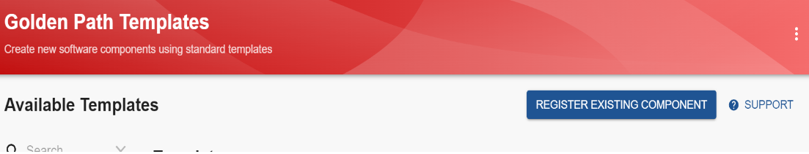
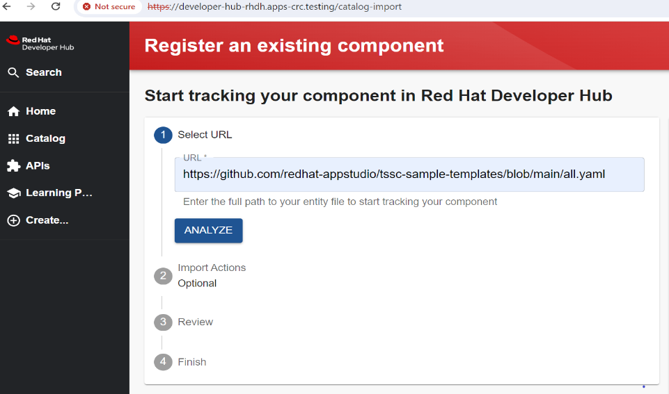
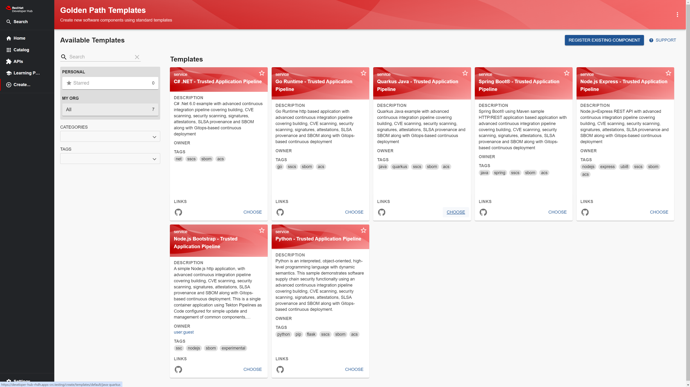
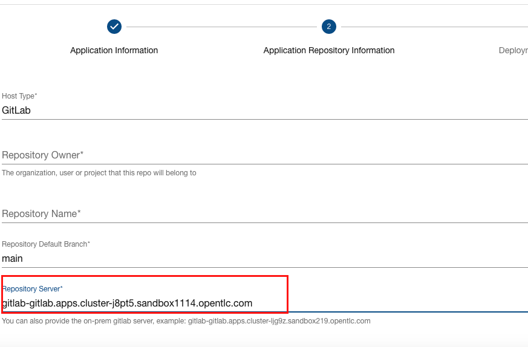
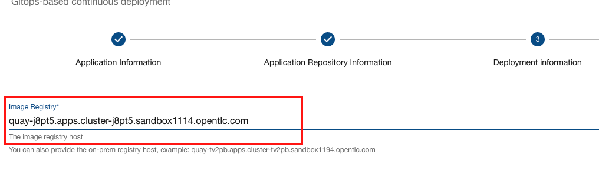

#  RHTAP Sample Backstage Templates


## Software Supply Chain Security 

This repository provides a suite of language/framework examples that implement end-to-end software supply chain security (SSCS).

The examples contain an advanced continuous integration pipeline covering building, CVE scanning, security scanning, signatures,  attestations, SLSA provenance and SBOM along with Gitops-based continuous deployment 

Software Template authors and IDP builders can take these samples to create their own SSCS based starters. The components in the samples are designed to be maintainable to ensure that day 2 maintainance of default build pipelines and deployment yaml ensures teams have 


## Usage in Red Hat Developer Hub

To import these templates, register a component in on the golden path template page 



Import `https://github.com/redhat-appstudio/tssc-sample-templates/blob/main/all.yaml`



## Usage in backstage 

Add the following to your `app-config.yaml` file in your backstage configuration 

``` 
    - type: url
      target:  https://github.com/redhat-appstudio/tssc-sample-templates/blob/main/all.yaml
      rules:
        - allow: [Location, Template]
```

This will add the samples into a set of backstage templates.




## On-prem host support

You need to ensure the on-prem host is being configured in `app-config.yaml` file in your backstage/RHDH configuration 

### Change default host for Git or Quay

[properties](./properties) file holds the default host for GitHub, GitLab and Quay.

Modify the value and run `./generate.sh` will generate new templates with customized default value.

### Provide on-prem host value when create a component

On `Application Repository Information` Page, provide your Git host in the `Repository Server`

**Note:** Please Ensure the correct `Host Type` is selected



On `Deployment information` Page, provide your Quay host in the `Image Registry`


 
## Contributing

The templates are found in `./templates` and reference reusable content in `./skeleton`.  

The templates are maintained by importing external samples into the software template format. This allows the external samples to be used standalone, developed, and evolved and then imported.

The pipelines are also maintained externally to allow standalone use outside of software templates, as well as evolution of the pipelines in one of more software templates.

To update the templates from these or any new samples you update the list of imported repos and run the following. 


 `./generate.sh` to generate all the templates before commit to this repository.


### MacOS 

Due to differences between Linux and MacOS, the GNU version of `sed` is required to be installed.

```
brew install gnu-sed
```
After this, alter PATH. For example, add the following line to your `~/.bash_profile`:
```
export PATH="/opt/homebrew/opt/gnu-sed/libexec/gnubin:$PATH"
```